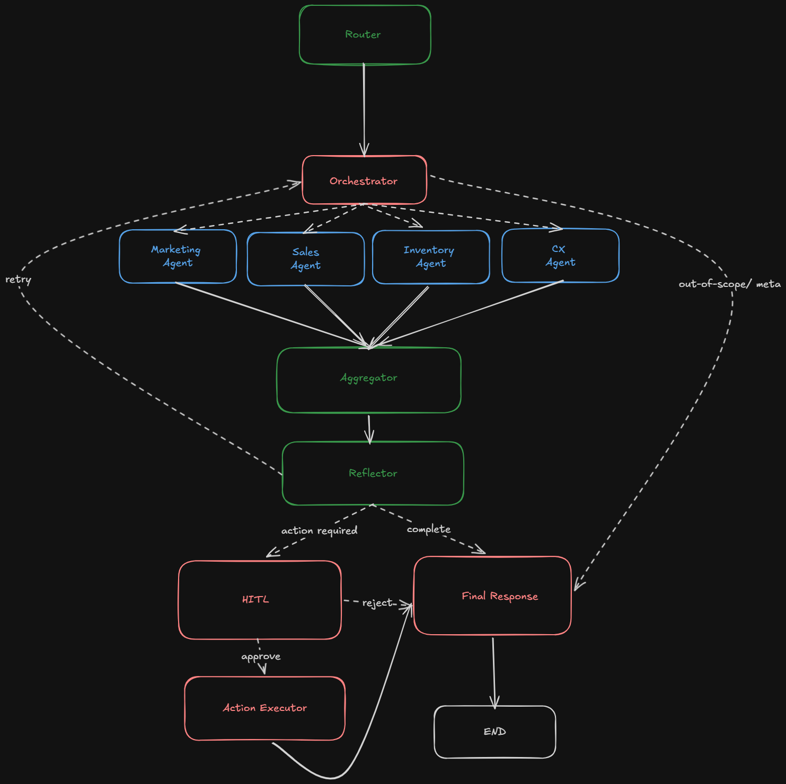

# E-Commerce Operations Assistant

An AI-powered operations platform that acts as a smart business manager for an online store. Ask natural language questions like "Why did sales drop yesterday?" and the system investigates across sales, inventory, marketing, and customer support domains, explains its findings, and suggests corrective actions with human approval.

## Architecture

The system uses a LangGraph multi-agent state machine with specialized domain agents:



**Services:**

| Service    | Description                                                | Port            |
| ---------- | ---------------------------------------------------------- | --------------- |
| Frontend   | Next.js 16 / React 19 chat interface                       | 3001            |
| Backend    | FastAPI server with LangGraph agent orchestration          | 8000            |
| MCP Server | FastMCP tool server exposing domain operations             | Internal (8001) |
| PostgreSQL | Application database (threads, incidents, e-commerce data) | 5431            |
| Qdrant     | Vector store for memory and past incident search           | 6333            |
| Langfuse   | LLM observability and tracing                              | 3000            |

**Tech Stack:** Next.js 16, React 19, Tailwind CSS 4, Bun, FastAPI, Python, LangGraph, LangChain, PostgreSQL, Qdrant, Docker Compose

## Prerequisites

- Docker and Docker Compose
- An OpenAI-compatible API key (Azure OpenAI via DIAL proxy)

## Setup

1. Clone the repository and navigate to the project root.

2. Create the environment file:

   ```bash
   cp .env.example .env
   ```

3. Fill in the required values in `.env`:

   **LLM API (required):**
   - `DIAL_API_KEY` - Your API key
   - `DIAL_ENDPOINT` - OpenAI-compatible endpoint URL
   - `DIAL_API_VERSION` - API version (e.g. `2023-12-01-preview`)
   - `DIAL_DEPLOYMENT` - Model deployment name

   **Langfuse and infrastructure (required, set to any secure values):**
   - `LANGFUSE_POSTGRES_PASSWORD`
   - `LANGFUSE_NEXTAUTH_SECRET`
   - `LANGFUSE_SALT`
   - `LANGFUSE_ENCRYPTION_KEY`
   - `LANGFUSE_INIT_USER_PASSWORD`
   - `CLICKHOUSE_PASSWORD`
   - `MINIO_ROOT_PASSWORD`

4. Start all services:

   ```bash
   docker compose up --build
   ```

5. To seed the database with sample e-commerce data on first run:

   ```bash
   SEED_DB=true docker compose up --build
   ```

6. Once all services are healthy, open http://localhost:3001 in your browser.

## Services URLs

| Service     | URL                        |
| ----------- | -------------------------- |
| Frontend    | http://localhost:3001      |
| Backend API | http://localhost:8000      |
| API Docs    | http://localhost:8000/docs |
| Langfuse    | http://localhost:3000      |

Langfuse default login: `admin@local.dev` / the password you set in `LANGFUSE_INIT_USER_PASSWORD`.

## Project Structure

```
backend/          FastAPI server, LangGraph agents, DB models, migrations
  agents/         Agent configs (YAML), graph definition, node logic
  api/            REST endpoints (query, incidents, actions, threads)
  db/             SQLAlchemy models, Alembic migrations, Qdrant client
frontend/         Next.js chat UI with SSE streaming and HITL action cards
mcp_servers/      FastMCP tool server with domain-specific tools
  domains/        Sales, inventory, marketing, customer support, memory tools
```

## Key Features

- **Multi-agent orchestration** - Specialized agents for sales, inventory, marketing, and customer support collaborate to answer complex business questions
- **Cross-domain reasoning** - Correlates signals across domains to identify root causes
- **Human-in-the-loop** - Proposes actions and waits for explicit human approval before execution
- **Memory** - Recalls past incidents and decisions using vector similarity search
- **Reflection** - Self-checks findings and requests additional data when conclusions are weak
- **Observability** - Full LLM tracing via Langfuse

## Local Development (without Docker)

**Backend** (requires PostgreSQL, Qdrant, and MCP server running):

```bash
cd backend
uv run alembic upgrade head
uv run uvicorn main:app --reload --port 8000
```

**MCP Server:**

```bash
cd mcp_servers
uv run python -m server
```

**Frontend:**

```bash
cd frontend
bun install
bun dev
```

## Testing

```bash
# Backend tests
cd backend
uv run pytest

# Contract tests only (fast, no external deps)
uv run pytest tests/test_contracts.py

# MCP server tests
cd mcp_servers
uv run pytest

# Frontend tests
cd frontend
bun run test:run
```
